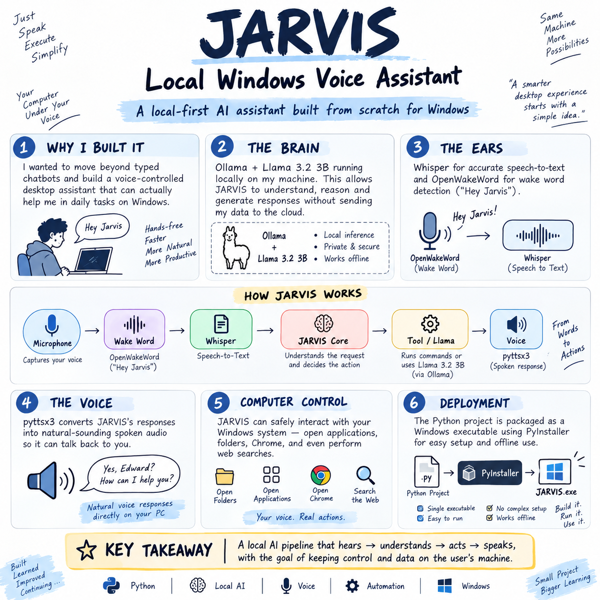

# 🤖 JARVIS - Local Windows Voice Assistant

<p align="center">
  
</p>

<p align="center">
  <strong>A local-first, voice-controlled AI assistant for Windows.</strong><br>
  Built with Python, Ollama, Llama 3.2, Whisper, OpenWakeWord, and Windows automation.
</p>

<p align="center">
  <a href="https://github.com/nithishedward/jarvis-local-windows-assistant/releases/latest/download/JARVIS-Windows-v1.0.0.zip"><strong>⬇️ Download JARVIS for Windows</strong></a>
  &nbsp;•&nbsp;
  <a href="https://github.com/nithishedward/jarvis-local-windows-assistant/releases/latest">View Latest Release</a>
  &nbsp;•&nbsp;
  <a href="https://github.com/nithishedward/jarvis-local-windows-assistant/issues">Report an Issue</a>
</p>

<p align="center">
  
  
  
  
  
</p>

## ✨ What is JARVIS?

JARVIS is a local-first Windows voice assistant that connects **speech recognition, a local large language model, voice synthesis, and predefined computer tools** into one workflow.

Say **“Hey Jarvis”**, speak naturally, and JARVIS can understand the request, answer using local AI, or perform supported Windows actions.

## 🚀 Current Capabilities

- 🎤 Voice input through the microphone
- ⚡ `Hey Jarvis` wake-word detection with OpenWakeWord
- 🗣️ Speech-to-text with Whisper
- 🧠 Local AI responses with Ollama + Llama 3.2 3B
- 🔊 Spoken responses with pyttsx3
- 💻 Windows application and folder automation
- 🌐 Chrome, Google, and YouTube search
- 📦 Windows executable packaging with PyInstaller
- 🔒 Local-first processing for the core assistant pipeline

## 🧠 Architecture

```text
                    🎤 Microphone
                          │
                          ▼
                ⚡ OpenWakeWord
                    "Hey Jarvis"
                          │
                          ▼
                       Whisper
                    Speech → Text
                          │
                          ▼
                 ┌─────────────────┐
                 │   JARVIS Core   │
                 └────────┬────────┘
                          │
             ┌────────────┴────────────┐
             ▼                         ▼
      💻 Computer Tools          🧠 Ollama
             │                    Llama 3.2 3B
             │                         │
             └────────────┬────────────┘
                          ▼
                    🔊 pyttsx3
                    Spoken Reply
```

## 🛠️ Tech Stack

| Technology | Role |
|---|---|
| Python 3.13 | Core application logic |
| Ollama | Local LLM runtime |
| Llama 3.2 3B | Local AI model |
| Whisper | Speech-to-text |
| OpenWakeWord | Wake-word detection |
| pyttsx3 | Text-to-speech |
| SoundDevice | Microphone input |
| SoundFile | Audio recording |
| Requests | Ollama API communication |
| PyInstaller | Windows packaging |

## 🎙️ Example Commands

After saying **“Hey Jarvis”**:

```text
Open Chrome
```

```text
Search Google for Python tutorials
```

```text
Search YouTube for machine learning tutorials
```

```text
Open Downloads
```

```text
What is artificial intelligence?
```

## 📥 Quick Start

### Requirements

- Windows 10/11
- Python 3.13
- Ollama
- Llama 3.2 3B
- FFmpeg
- Working microphone and speakers

### 1. Clone the repository

```powershell
git clone https://github.com/nithishedward/jarvis-local-windows-assistant.git
cd jarvis-local-windows-assistant
```

### 2. Create a virtual environment

```powershell
python -m venv .venv
.venv\Scripts\Activate.ps1
```

### 3. Install dependencies

```powershell
pip install -r requirements.txt
```

### 4. Download the Llama model

```powershell
ollama pull llama3.2:3b
```

### 5. Start JARVIS

```powershell
python jarvis_main.py
```

## 🪟 Windows Release

A packaged Windows build is available from the latest GitHub release.

<p align="center">
  <a href="https://github.com/nithishedward/jarvis-local-windows-assistant/releases/latest/download/JARVIS-Windows-v1.0.0.zip"><strong>⬇️ Download JARVIS-Windows-v1.0.0.zip</strong></a>
</p>

Installation:

1. Download the ZIP.
2. Extract it.
3. Open the `JARVIS` folder.
4. Run `JARVIS.exe`.
5. Say **“Hey Jarvis”**.

## 🔐 Safety & Privacy

JARVIS currently uses a predefined set of computer tools. It does **not** give the AI unrestricted PowerShell access, arbitrary command execution, or file deletion capabilities.

Core speech processing, wake-word detection, and LLM inference are designed to run locally. Internet access is used for features such as web search and downloading dependencies or models.

## 🗺️ Roadmap

- [x] Voice input
- [x] Speech-to-text
- [x] Local LLM integration
- [x] Text-to-speech
- [x] `Hey Jarvis` wake-word detection
- [x] Windows automation
- [x] Web search
- [x] Windows executable
- [ ] Custom `Jarvis` wake word
- [ ] Better conversational memory
- [ ] Screen vision
- [ ] Safer multi-step agent/tool execution
- [ ] Better Windows application control
- [ ] Modular skill system
- [ ] Desktop GUI / JARVIS HUD
- [ ] Windows startup integration
- [ ] Packaged Windows installer

## 🤝 Contributing

Ideas, bug reports, feature requests, and pull requests are welcome.

Please open an issue before major changes so the direction can be discussed first.

## 👨‍💻 Developer

**Nithish Edward**  
Artificial Intelligence & Data Science Student

- GitHub: https://github.com/nithishedward
- Project: https://github.com/nithishedward/jarvis-local-windows-assistant

---

⭐ If you find JARVIS interesting, consider starring the repository.

**Built to learn. Built to experiment. Built to make local AI useful. 🚀**
